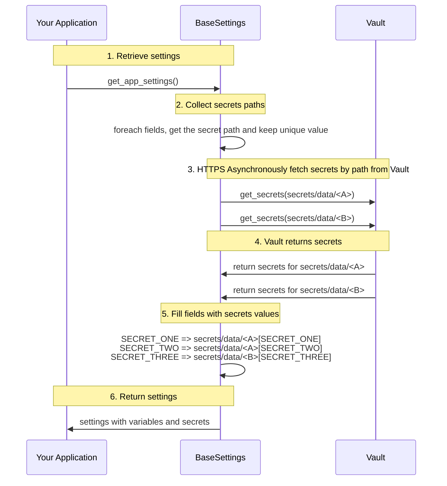

# Pydantic2-Settings-Vault

Pydantic2-Settings-Vault is a simple extension of Pydantic Settings to collect secrets from HashiCorp Vault OpenSource (OSS) and Enterprise


### Demonstration:

```python
from functools import lru_cache
from threading import Lock
from typing import Tuple, Type
from pydantic import Field, SecretStr
from pydantic_settings import (
    BaseSettings,
    PydanticBaseSettingsSource,
)
from pydantic2_settings_vault import VaultConfigSettingsSource

class AppSettings(BaseSettings):

    MY_SECRET: SecretStr = Field(
        ...,
        json_schema_extra={
            "vault_secret_path": "secret/data/test",
            "vault_secret_key": "FOO",  # pragma: allowlist secret
        },
    )
    
    @classmethod
    def settings_customise_sources(
        cls,
        settings_cls: Type[BaseSettings],
        init_settings: PydanticBaseSettingsSource,
        env_settings: PydanticBaseSettingsSource,
        dotenv_settings: PydanticBaseSettingsSource,
        file_secret_settings: PydanticBaseSettingsSource,
    ) -> Tuple[PydanticBaseSettingsSource, ...]:
        return (
            init_settings,
            env_settings,
            dotenv_settings,
            VaultConfigSettingsSource(settings_cls=settings_cls),
        )

# The connection to Vault is done via HTTPS with AppRole authentication
import os
os.environ['VAULT_URL'] = "<configure it>"
os.environ['VAULT_ROLE_ID'] = "<configure it>"
os.environ['VAULT_SECRET_ID'] = "<configure it>"

# Only with Enterprise edition
os.environ['VAULT_NAMESPACE'] = "<configure it>"

### Usage
app_settings_lock = Lock()

@lru_cache
def get_app_settings() -> AppSettings:
    with app_settings_lock:
        return AppSettings()  # type: ignore
```

### Internal interactions:


## Table of Contents

- [Pydantic2-Settings-Vault](#Pydantic2-Settings-Vault)
  - [Table of Contents](#table-of-contents)
  - [Description](#description)
  - [Installation](#installation)
  - [License](#license)
  - [Contact](#contact)

## Description

Pydantic2-Settings-Vault is a extension for Pydantic Settings that enables secure configuration management by integrating with HashiCorp Vault. This library supports both the open-source (OSS) and Enterprise versions of Vault, providing a seamless way to retrieve and manage secrets within your Pydantic-based applications. By leveraging Vault's robust security features, Pydantic2-Settings-Vault allows developers to easily incorporate secure secret management practices into their Python projects, enhancing overall application security and simplifying the handling of sensitive configuration data.

## Installation

```bash
# Install the dependency
pip install pydantic2-settings-vault
uv add pydantic2-settings-vault
poetry add pydantic2-settings-vault
```

## License

Pydantic2-Settings-Vault is released under the MIT License. See the [LICENSE](LICENSE) file for more details.

## Contact

For questions, suggestions, or issues related to Pydantic2-Settings-Vault, please open an issue on the GitHub repository.

